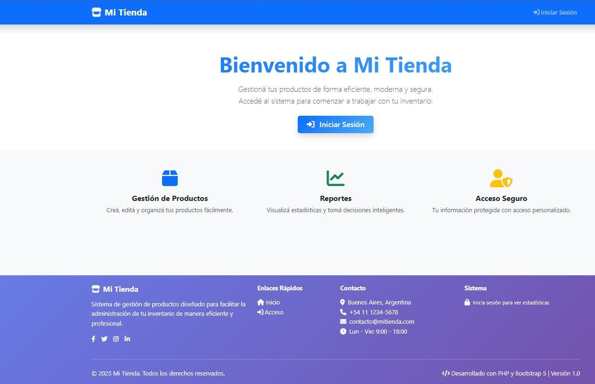
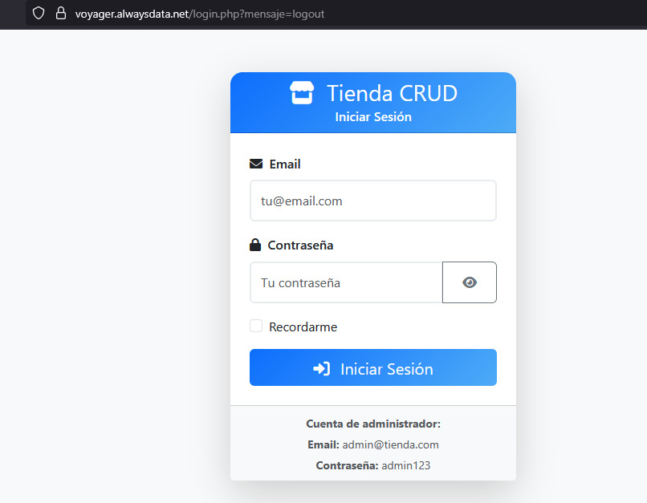
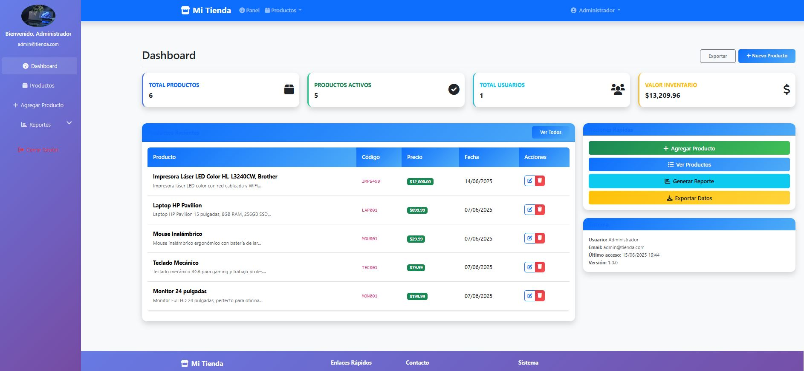
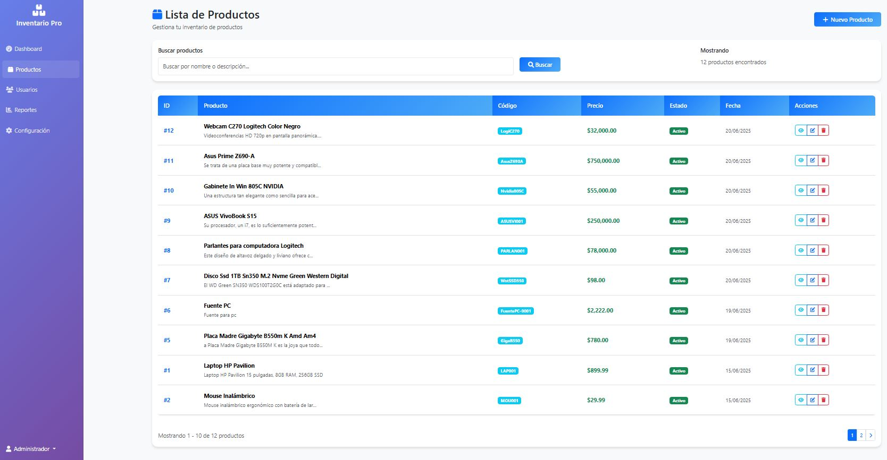
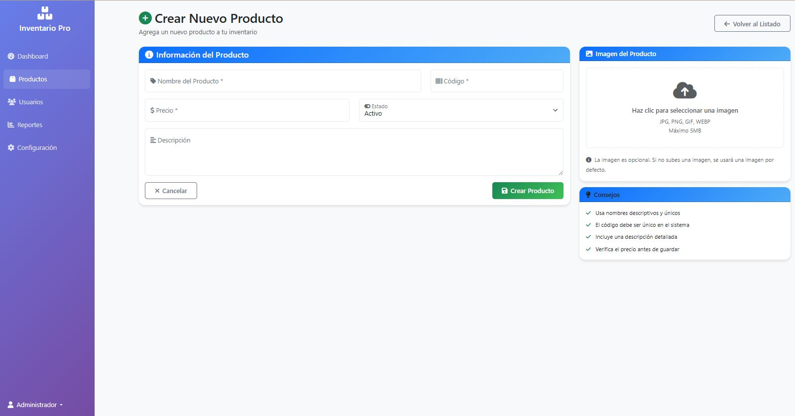
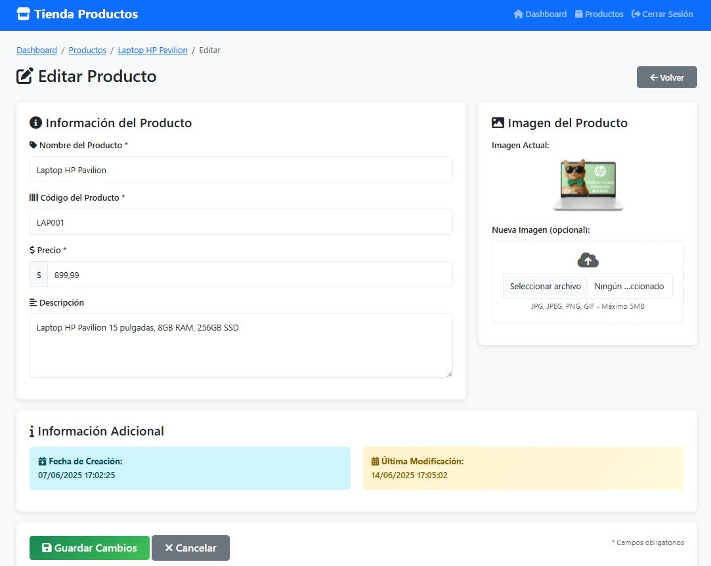
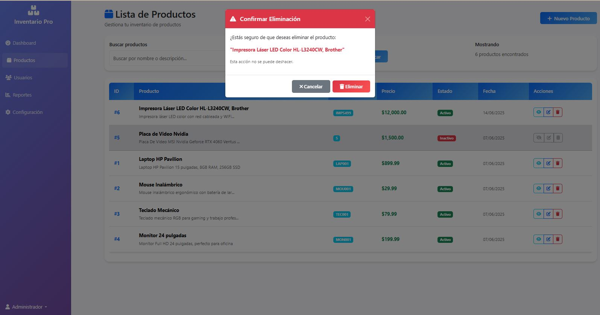

# 🛒 Mi Tienda - Sistema de Gestión de Inventario

Bienvenido a **Mi Tienda**, una aplicación web desarrollada en PHP que permite gestionar productos de forma eficiente, visual y segura. Diseñada con un enfoque profesional y estético, ideal para pequeños emprendimientos, proyectos educativos o portfolios de programación.

---

## 🚀 Características

- Panel de control con estadísticas en tiempo real
- Gestión completa de productos (crear, listar, editar, eliminar)
- Soporte para productos activos/inactivos
- Interfaz moderna con Bootstrap 5
- Sistema de login con control de sesiones
- Buscador y paginación
- Seguridad básica contra accesos no autorizados

---

## 🛠️ Tecnologías utilizadas

- **Frontend:** HTML5, CSS3, Bootstrap 5, Font Awesome
- **Backend:** PHP 8+, MySQL con PDO
- **Base de datos:** MySQL Workbench
- **Estilo personalizado:** Hoja CSS modular (`style.css`)
- **Íconos:** Font Awesome, Bootstrap Icons

---

## 🧪 Estructura del proyecto

```
/assets
    /img
    /css
        style.css
    /js
        script.js
/config
    config.php
    database.php
/productos
    /uploads (Para las imagenes cargadas)
    listar.php
    crear.php
    editar.php
    eliminar.php
    ver.php
/includes
    header.php
    footer.php
index.php
login.php
dashboard.php
logout.php
```

---

## ⚙️ Instalación

1. Cloná el repositorio o descargá el ZIP:

```bash
git clone https://github.com/SonyGahan/mi-tienda.git
```

2. Configurá la base de datos:

- Importá el archivo `BDcodigo.sql` o creá tu propia tabla `productos` y `usuarios`.

3. Configurá tu entorno local:

- En `config/config.php`, asegurate de definir `BASE_URL` correctamente.
- En `config/database.php`, modificá tus credenciales de conexión:

```php
define('DB_HOST', 'localhost');
define('DB_NAME', 'mi_tienda');
define('DB_USER', 'root');
define('DB_PASS', '');
```

4. Iniciá tu servidor local (XAMPP, Laragon, etc.) y accedé a:

```
http://localhost/mi-tienda/index.php
```

---

## 📷 Capturas de pantalla

> Agregá tus capturas en `assets/img` y enlazalas aquí:










---

## 🤝 Contribuciones

Las contribuciones son bienvenidas. Si deseas mejorar el proyecto o agregar nuevas funcionalidades, sigue estos pasos:

1. **Haz un Fork** del repositorio.
2. Crea una nueva rama con una descripción clara:
   ```bash
   git checkout -b nueva-funcionalidad
   ```
3. Realiza tus cambios y haz un commit:
   ```bash
   git commit -m "Agrega nueva funcionalidad X"
   ```
4. Sube los cambios a tu repositorio remoto:
   ```bash
   git push origin nueva-funcionalidad
   ```
5. Crea un **Pull Request** en este repositorio.
---

## 📄 Licencia
Este proyecto está bajo la **Licencia MIT**. Consulta el archivo [LICENSE](LICENSE.md) para más detalles.

---

## 💻 Agradecimientos

🚀 Gracias por visitar mi repositorio y por tu interés en este proyecto. ¡Espero que te sea útil! 😄
> “Este proyecto nació con amor, código limpio y mucho café ☕. No es solo un CRUD, es una experiencia de gestión pensada con estilo.”   

⌨️ Construido con ❤️ por **Sonia Pereira, Pablo Rodriguez, nuestro Grupo 2** y con la increible, agradable ayuda de Chatty  😊